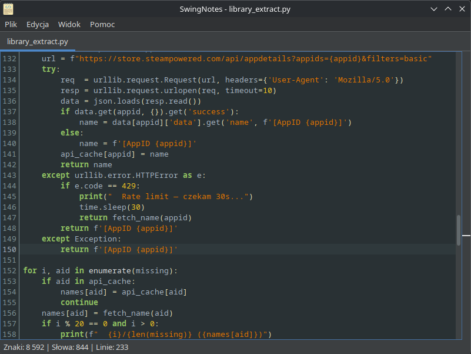
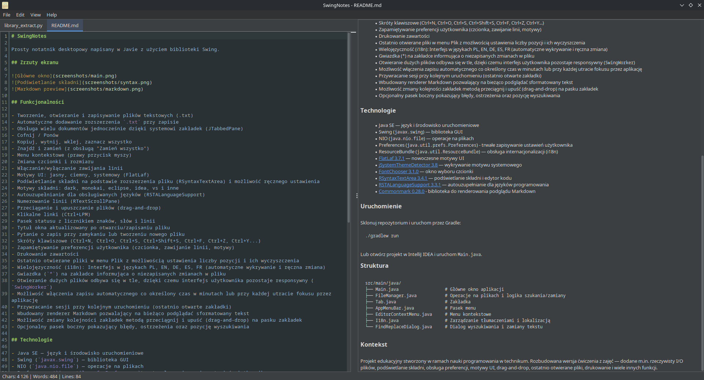

# SwingNotes


Nowoczesny edytor tekstu z podświetlaniem składni dla programistów. Obsługuje 50+ języków programowania, oferuje motywy UI, autouzupełnianie kodu, podgląd Markdown i wiele więcej.

## Zrzuty ekranu




## Funkcjonalności

### Podstawowe
- Tworzenie, otwieranie i zapisywanie plików
- Obsługa wielu dokumentów (system zakładek)
- Cofnij/Ponów, kopiuj/wytnij/wklej
- Znajdź i zamień

### Edytor kodu
- Podświetlanie składni (50+ języków)
- Autouzupełnianie
- Numerowanie linii
- Klikalne linki

### Personalizacja
- 3 motywy UI (jasny/ciemny/systemowy)
- 7 motywów składni
- Wybór czcionki i rozmiaru
- 5 języków interfejsu (PL, EN, DE, ES, FR)

### Zaawansowane
- Drag-and-drop plików
- Markdown preview
- Autosave
- Przywracanie sesji
- Drukowanie

<details>
<summary>Pełna lista funkcjonalności</summary>
- Tworzenie, otwieranie i zapisywanie plików tekstowych (.txt)
- Automatyczne dodawanie rozszerzenia `.txt` przy zapisie
- Obsługa wielu dokumentów jednocześnie dzięki systemowi zakładek (JTabbedPane)
- Cofnij / Ponów
- Kopiuj, wytnij, wklej, zaznacz wszystko
- Znajdź i zamień (z obsługą "Zamień wszystko")
- Menu kontekstowe (prawy przycisk myszy)
- Zmiana czcionki i rozmiaru
- Włączanie/wyłączanie zawijania linii
- Motywy UI: jasny, ciemny, systemowy (FlatLaf)
- Podświetlanie składni na podstawie rozszerzenia pliku (RSyntaxTextArea) i możliwość ręcznego ustawienia
- Motywy składni: dark, monokai, eclipse, idea, vs i inne
- Autouzupełnianie dla obsługiwanych języków (RSTALanguageSupport)
- Numerowanie linii (RTextScrollPane)
- Przeciąganie i upuszczanie plików (drag-and-drop)
- Klikalne linki (Ctrl+LPM)
- Pasek statusu z licznikiem znaków, słów i linii
- Tytuł okna aktualizowany po otwarciu/zapisaniu pliku
- Pytanie o zapis przy zamykaniu lub tworzeniu nowego pliku
- Skróty klawiszowe (Ctrl+N, Ctrl+O, Ctrl+S, Ctrl+Shift+S, Ctrl+F, Ctrl+Z, Ctrl+Y...)
- Zapamiętywanie preferencji użytkownika (czcionka, zawijanie linii, motywy)
- Drukowanie zawartości
- Ostatnio otwierane pliki w menu Plik z możliwością ustawienia liczby pozycji i ich wyczyszczenia
- Wielojęzyczność (i18n): Interfejs w językach PL, EN, DE, ES, FR (automatyczne wykrywanie i ręczna zmiana)
- Gwiazdka (`*`) na zakładce informująca o niezapisanych zmianach w pliku
- Otwieranie dużych plików odbywa się w tle, dzięki czemu interfejs użytkownika pozostaje responsywny (`SwingWorker`)
- Możliwość włączenia zapisu automatycznego co określony czas w minutach lub przy każdej utracie fokusu przez aplikację
- Przywracanie sesji przy kolejnym uruchomieniu (ostatnio otwarte zakładki)
- Wbudowany renderer Markdown pozwalający na bieżąco podglądać sformatowany tekst
- Możliwość zmiany kolejności zakładek metodą przeciągnij i upuść (drag-and-drop) na pasku zakładek
- Opcjonalny pasek boczny pokazujący błędy, ostrzeżenia oraz pozycję wyszukiwania
</details>

### Uwagi
- Autouzupełnianie działa dla podstawowej składni języków

## Technologie

- Java SE — język i środowisko uruchomieniowe
- Swing (`javax.swing`) — biblioteka GUI
- NIO (`java.nio.file`) — operacje na plikach
- Preferences (`java.util.prefs.Preferences`) - trwałe zapisywanie ustawień użytkownika
- ResourceBundle (`java.util.ResourceBundle`) — obsługa internacjonalizacji (i18n)
- [FlatLaf 3.7.1](https://github.com/JFormDesigner/FlatLaf) — nowoczesne motywy UI
- [jSystemThemeDetector 3.8](https://github.com/Dansoftowner/jSystemThemeDetector) — wykrywanie motywu systemowego
- [FontChooser 3.1.0](https://github.com/dheid/fontchooser) — okno wyboru czcionki
- [RSyntaxTextArea 3.4.1](https://github.com/bobbylight/RSyntaxTextArea) — podświetlanie składni i edytor kodu
- [RSTALanguageSupport 3.3.1](https://github.com/bobbylight/RSTALanguageSupport) — autouzupełnianie dla języków programowania
- [Commonmark 0.28.0](https://github.com/commonmark/commonmark-java) - biblioteka do renderowania podglądu Markdown

## Instalacja

### Linux
Pobierz i uruchom AppImage ze strony [Releases](https://github.com/teksek/SwingNotes/releases). Polecam zintegrować z systemem używając programów takich jak [AppManager](https://github.com/kem-a/AppManager).

### Windows
Wsparcie dla natywnego instalatora .exe planowane w wersji 2.0.

### Inne systemy
Wymagania: Java 21 lub nowsza

Jeśli masz zainstalowaną Javę, możesz po prostu kliknąć dwukrotnie na plik `.jar` pobranego ze strony [Releases](https://github.com/teksek/SwingNotes/releases) lub użyć terminala:
```bash
java -jar SwingNotes.jar
```

Uruchom przez Gradle:
```bash
./gradlew run
```

## Struktura

```
src/main/java/
├── Main.java                  # Główne okno aplikacji
├── FileManager.java           # Operacje na plikach i logika szukania/zamiany
├── Tab.java                   # Zakładka
├── AppMenuBar.java            # Pasek menu
├── EditorContextMenu.java     # Menu kontekstowe
├── I18n.java                  # Zarządzanie tłumaczeniami i lokalizacją
└── FindReplaceDialog.java     # Dialog wyszukiwania i zamiany tekstu
```

## Kontekst

Projekt edukacyjny stworzony w ramach nauki programowania w technikum. Rozbudowana wersja ćwiczenia z zajęć — dodane m.in. rzeczywisty I/O plików, podświetlanie składni, obsługa preferencji, motywy UI, drag-and-drop, ostatnio otwierane pliki, drukowanie i wiele innych funkcji.

## Author
Created by [teksek](https://github.com/teksek) with ❤️.